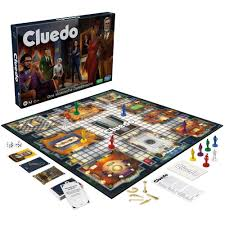

# Rapport de Projet Logiciel Transverse : CLUEDO

[Louis-Mathis MASSIN](https://github.com/lmmas), [Cassandre CHANDELIER](https://github.com/CassandreChandelier), [Cyprien GABORIEAU](https://github.com/Nyries), [Bastien DUQUENNOY](https://github.com/Bastoune9)

## Table des matières : (à compléter)
1. [Présentation générale](##présentation-générale)

   1.1 [Archétype du jeu](###archétype-du-jeu)

   1.2 [Règles du jeu](###règles-du-jeu)

   1.3 [Ressources](###ressources)

## 1. Présentation générale

### 1.1 Archétype du jeu
L'objectif de ce projet est de réaliser le jeu de plateau **CLUEDO** en C++.
Le CLUEDO est un jeu de société classique d'enquête et de déduction, conçu par Anthony E. Pratt en 1943 et publié pour la première fois en 1949.
Jouable de 3 à 6 joueurs, il se déroule dans un manoir victorien fictif, où les participants endossent le rôle de détectives pour résoudre un meurtre mystérieux.

### 1.2 Règles du jeu
Samuel Lenoir est retrouvé mort dans sa demeure… La police a découvert sur place six suspects et six armes disséminées dans les 9 pièces de la maison mais n’a pas pu résoudre le mystère. A vous de mener votre enquête pour trouver la solution !

Pour remporter la partie, vous devez déterminer :
1. Qui a tué Samuel Lenoir ?
2. Avec quelle arme ?
3. Et dans quelle pièce ?

### But du jeu :

- Résoudre le mystère ! Pour gagner, vous devez être le premier joueur à déduire quelles sont les cartes suspect, arme et pièce qui se trouvent dans l’étui confidentiel au centre du plateau.

### Comment jouer :

**Début du jeu :**

- On place chaque pion personnage et arme sur sa case de départ.
- Puis mélange séparément les cartes indices. On en sélectionne secrètement une de chaque que l'on cache dans l'étui mystère, puis on distribue le reste des cartes aux joueurs.
- Chaque joueur doit garder sa main secrète, et il est possible que les joueurs n'aient pas tous le même nombre de cartes.
- Chaque joueur lance ensuite les dés. Celui qui obtient le meilleur score commence à jouer. La partie continue ensuite dans le sens des aiguilles d’une montre.

**A votre tour, lancez les dés et déplacez-vous sur le plateau :**
- Lancez les dés et déplacez votre pion personnage sur le plateau du nombre de cases obtenues avec les dés. 
- Vous pouvez déplacer votre pion verticalement ou horizontalement sur les cases ce couloir, mais jamais en diagonale.
- Lorsqu'un pion personnage atteint une case de porte, le joueur peut choisir d'entrer dans la pièce de la maison associée.
- Vous n’êtes pas obligé d’utiliser la totalité du score indiqué par les dés pour votre déplacement. Dès qu'un joueur entre dans une pièce, il termine sa phase de déplacement.

**Émettez ensuite une hypothèse pour obtenir des réponses :**
- Lorsqu'un joueur entre dans une pièce, il peut émettre une hypothèse avec **un suspect, une arme et la pièce dans laquelle il se trouve.**
  Exemple : après être rentré dans le Garage : « Est-ce Rose avec une Corde dans le Garage ? »
- Déplacez le pion personnage et le pion arme que vous citez dans la pièce où vous vous trouvez.
- Si le pion d'un joueur a été déplacé par un autre joueur depuis votre dernier tour, il peut choisir de ne pas bouger et d’émettre une hypothèse directement.
- Le joueur placé à votre gauche est le premier à répondre à votre hypothèse. S’il possède au moins une des cartes des éléments que vous avez cités, il **doit** vous en montrer une en cachette des autres joueurs. S'il en possède plusieurs, il choisit la carte qu'il révèle.
- Si le joueur ne possède aucune des cartes que vous citez dans votre hypothèse, il dit simplement « Je ne peux pas répondre. » et c’est au joueur situé à sa gauche de répondre. On continue de cette façon jusqu’à ce qu’une carte soit dévoilée ou que tous les joueurs aient été interrogés.
- Vous ne pouvez pas effectuer une hypothèse dans la même pièce 2 fois de suite. Vous devez d'abord changer de pièce et revenir ensuite.

**Enfin, terminez votre tour en cochant les cases sur votre feuille de détective :**
- Cochez les cases des éléments qui vous ont été montrés pendant ce tour. Si une carte se trouve dans la main d'un adversaire, elle ne se trouve pas dans l'étui mystère et n'est donc pas lié au meurtre !
- **Et si aucun joueur ne vous montre de carte ?** Si une carte ne se trouve ni dans votre main, ni dans celles de vos adversaires, alors elle se trouve dans l'étui mystère ! 
- Laissez les pions personnage et arme là où vous les avez déplacés. Si le pion personnage que vous avez déplacé appartient à un autre joueur, celui-ci repartira de sa nouvelle position lors de son prochain tour.
- Votre tour est maintenant terminé. C’est au joueur situé à votre gauche de jouer.

**Portez une accusation (optionnel) :**

A la fin du tour de chaque joueur, celui-ci **peut** tenter de faire une accusation s'il pense connaître les trois cartes présentes dans l'étui secret.

Il porte votre accusation à haute voix :  « J’accuse Olive avec la Barre de Fer dans la Salle à Manger ! ». Puis, à l’abri du regard des autres joueurs, il vérifie le contenu de l’étui confidentiel.

**Avez-vous résolu le mystère ?**

- OUI ! Les trois cartes sont les mêmes que celles de mon accusation !
Félicitations ! Vous remportez la partie !
- NON ! Vous avez commis une erreur : vous êtes éliminé !
- Lorsqu'un joueur est éliminé, il ne peut plus porter d’accusation ni émettre d’hypothèses, mais il continue à montrer des cartes aux autres joueurs lorsqu’ils émettent des hypothèses.
- Si tous les joueurs se trompent , l’affaire reste non résolue.

**Déplacements futés :**
Des passages secrets sont présents dans la maison. Vous pouvez les utiliser pour passer d’une pièce a une autre.

### 1.3 Ressources

**Modélisation du plateau de jeu :**

**Cartes indices :**

## 2. Description et conception des états

### 2.1 Description des états
Les états du jeu comprennent toutes les informations nécessaires au bon fonctionnement du moteur du jeu.

Cela inclut toutes les informations sur les joueurs, les cartes indices, et une décomposition de la carte du manoir en salles et en cellules (couloir & portes).

#### Les joueurs
Un joueur (PlayerInfo) est caractérisé par son identité (quel suspect il incarne), sa position sur le plateau et sa main (vecteur de cartes indices).
On garde également en mémoire la dernière pièce dans laquelle il a effectué une hypothèse puisqu'il ne peut pas en effectuer plusieurs à la suite au même endroit.
Enfin, on lui associe une valeur booléenne indiquant s'il a effectué une accusation, puisqu'un joueur ayant fait une mauvaise accusation ne prend plus part à la partie.

#### Le plateau de jeu
Les cases du plateau sont stockées dans un tableau.
Une case est caractérisée par des coordonnées et par un type (CORRIDOR, DOOR, ROOM, INACCESSIBLE).
- Une case DOOR est un cas particulier de case CORRIDOR, et possède une référence à la SALLE à laquelle elle mène.
- Une ROOM est caractérisée par son nom, la liste de ses portes, et par une éventuelle autre SALLE qui serait accessible par passage secret.
- On qualifie d'INACCESSIBLE les cases auxquelles les joueurs ne peuvent pas accéder (extérieur du manoir & pièce centrale).

#### Les cartes indice
Chaque carte indice est caractérisée par un type (SUSPECT_CARD, WEAPON_CARD, ROOM_CARD) et par un identifiant.
On renseigne le nom de chaque carte au sein d'un "enum" pour chaque type de carte.

### 2.2 Conception logiciel

(image dernière version du state.dia)

